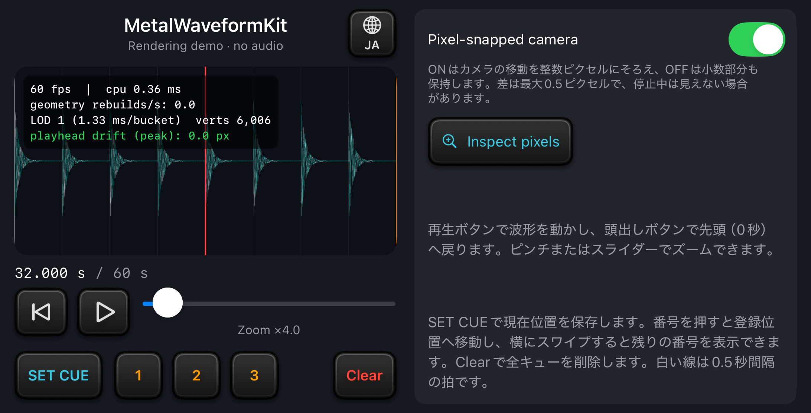

# MetalWaveformKit

[English](README.md) | 日本語

SwiftとMetalで音声波形を描画するライブラリです。波形・再生線・キューマーカー・拍グリッドを、共通の時間軸で表示します。

<p align="center">
  
</p>

付属のiOSサンプルアプリRenderingDemoです。合成データで波形を動かし、音声は再生しません。

リポジトリ：[masaconm/MetalWaveformKit](https://github.com/masaconm/MetalWaveformKit)。

## できること

- 音声の振幅サンプル列（PCM）から最小値・最大値を区間ごとに集約し、ズームに合う詳細度（LOD）を選択
- 波形とマーカーで、1フレームに一度取得した再生位置・ズーム・キュー時刻を共有
- 描画バッファを再利用し、ピクセルスナップと4倍のマルチサンプルアンチエイリアシング（MSAA）で縁の明滅を軽減
- 任意の時刻へのマーカー表示と、一定間隔の拍グリッド

音声のデコード・再生、音声クロック、BPM検出、キューの実行、操作用ジェスチャは利用側のアプリで用意します。

## 導入

| 項目 | 条件 |
| --- | --- |
| Swift | ツールチェーン6.1以降、Swift 6言語モード |
| OS | iOS 17 / macOS 14以降。SwiftUIビューはiOSのみ |
| 描画 | Metal対応環境と、MetalをコンパイルできるXcode |
| 外部パッケージ | 依存なし |

ローカルではXcode 27.1で検証しています。Swift 6.1での実ビルドと、対応OS全バージョンでの動作は未検証です。[確認済みの環境と結果](docs/VALIDATION.ja.md)を参照してください。

必要な機能だけを組み込む場合は、[製品ごとの役割と依存関係](docs/ARCHITECTURE.ja.md)を参照してください。

### Swift Package Manager

パッケージURLは`https://github.com/masaconm/MetalWaveformKit.git`です。

1. Xcodeで **File → Add Package Dependencies…** を選び、パッケージURLを入力します。
2. **Dependency Rule**で **Branch** を選び、`main`を指定します。
3. 製品`MetalWaveformKit`をアプリのターゲットへ追加します。

`Package.swift`で管理する場合は、パッケージの依存に追加します。

```swift
.package(url: "https://github.com/masaconm/MetalWaveformKit.git", from: "0.1.0")
```

利用するターゲットの依存に追加します。

```swift
.product(name: "MetalWaveformKit", package: "MetalWaveformKit")
```

### ローカルパッケージ

クローンしたフォルダを使う場合は、Xcodeの **Add Package Dependencies… → Add Local…** からフォルダを選び、製品`MetalWaveformKit`をアプリへ追加します。

SwiftPMでは、次のパッケージ依存を追加します。パスは配置先に合わせて変更してください。

```swift
.package(name: "MetalWaveformKit", path: "../MetalWaveformKit")
```

## 波形を表示する

PCMを`WaveformAnalyzer.analyze(samples:sampleRate:)`で解析し、その結果からレンダラーを作ります。次の例は0.5秒の位置を中心に静止表示する設定です。

```swift
import Metal
import SwiftUI
import MetalWaveformKit

@MainActor
func makeWaveformRenderer(analysis: WaveformAnalysis) -> WaveformRenderer? {
    guard let device = MTLCreateSystemDefaultDevice(),
          let renderer = WaveformRenderer(device: device) else { return nil }
    renderer.analysis = analysis
    renderer.frameInputProvider = {
        WaveformFrameInput(playheadSec: 0.5, zoomScale: 16)
    }
    return renderer
}
```

作成したレンダラーを`@State`や画面モデルで保持し、`WaveformMetalView(renderer: renderer)`へ渡します。[導入ガイド](docs/GETTING_STARTED.ja.md)には、PCMの生成・解析から表示まで試せるビューがあります。同じコードをサンプルアプリのビルドでコンパイルしています。

音声と連動させる場合は、`timedFrameInputProvider`が受け取る表示予定のホスト時刻を、トラック内の再生位置へ変換します。引数は`CACurrentMediaTime()`と同じ基準の時刻で、トラック先頭からの秒数ではありません。[音声クロックとの対応付け](docs/GETTING_STARTED.ja.md#音声の再生位置と連動させる)を参照してください。

## サンプルを動かす

1. `Examples/RenderingDemo/RenderingDemo.xcodeproj`を開きます。
2. **RenderingDemo**を選びます。
3. iPhone / iPadシミュレーターで実行します。実機では、Xcodeで自身の署名チームを指定してください。

起動直後は32秒の位置・4倍ズームで停止し、描画統計のHUDを表示します。

| 操作 | 動作 |
| --- | --- |
| 再生アイコン | 波形を動かす |
| ピンチまたはスライダー | ズームを変更する |
| SET CUE | 現在位置を保存する |
| Inspect pixels | スナップON/OFFの実描画を24倍に拡大して比較する |
| 地球アイコン（EN／JA） | 説明文を日本語と英語で切り替える。タイトルやボタン名は英語のまま |

操作方法、画像、動画は[サンプルガイド](docs/EXAMPLES.ja.md)にまとめています。

実機で滑らかさを確認する場合は、Release構成でデバッガを付けずに起動する **RenderingDemo Performance** を選びます。[実機での確認手順](docs/EXAMPLES.ja.md#実機で滑らかさを確認する)を参照してください。

## 描画の精度と制約

既定の同期モードでは再生線を画面中央に固定し、波形・拍グリッド・キューに共通のスナップ済み座標を使います。再生線が示す時刻をこの座標変換で描いた位置は、スナップによる丸めで再生線の中心から最大0.5描画ピクセルずれます。これに浮動小数点演算とラスタライズの許容差が加わります。

LODは区間ごとの振幅上下限を保持し、極値の厳密な時刻は保存しません。

ビューは画面の最大リフレッシュレートを要求しますが、ProMotionを含む実際のfpsはOSや描画条件に左右されます。高倍率では、細かな周期波形の動きをフレームごとに表示することで、明滅して見える場合もあります。一定のfpsや、スピーカー出力との同期精度は保証しません。

## ドキュメント

| 知りたいこと | 参照先 |
| --- | --- |
| プロジェクトへの導入と基本的な使い方 | [導入ガイド](docs/GETTING_STARTED.ja.md) |
| モジュールの役割と依存方向 | [パッケージ構成](docs/ARCHITECTURE.ja.md) |
| 座標変換、LOD、精度、更新タイミング | [描画の設計](docs/DESIGN.ja.md) |
| 確認済みの環境と利用時の制約 | [動作確認](docs/VALIDATION.ja.md) |
| サンプルの操作と画像・動画 | [サンプルガイド](docs/EXAMPLES.ja.md) |

## 問い合わせ・貢献

不具合は[GitHub Issues](https://github.com/masaconm/MetalWaveformKit/issues)へ報告してください。再現に必要な情報とテスト手順は[ CONTRIBUTING.md ](CONTRIBUTING.md)にまとめています。

APIの変更は[変更履歴（英語）](CHANGELOG.md)で案内します。1.0.0より前のAPIは変更される可能性があります。

## 背景・ライセンス

10バンドイコライザーアプリの開発では、再生や操作に波形をリアルタイムで追従させる必要がありました。MetalWaveformKitは、その課題を調べた検証から生まれたライブラリです。

検証では、再生時刻と描画座標の対応付け、フレーム単位の入力共有、波形解析と描画更新の分離に取り組みました。これらの設計をSwiftとMetalで再実装し、ソースコード・サンプル・テストを通じて手元で確かめられる形にしています。

[MIT](LICENSE) © 2026 masacom。
