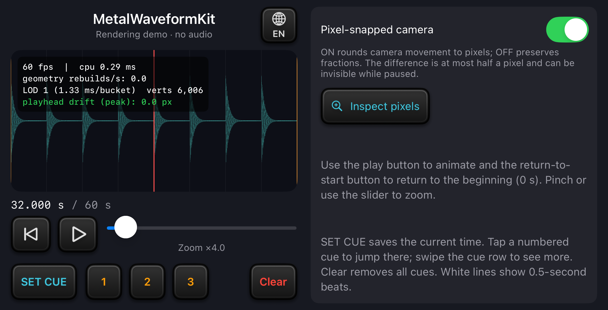

# MetalWaveformKit

English | [日本語](README.ja.md)

A Swift and Metal library for rendering audio waveforms, a playhead, cue markers and a beat grid on a shared time axis.

<p align="center">
  
</p>

RenderingDemo, the included iOS sample app, uses generated data and produces no audio.

Repository: [masaconm/MetalWaveformKit](https://github.com/masaconm/MetalWaveformKit).

## Features

- Analyze PCM audio samples into minimum/maximum amplitude buckets and select a level of detail (LOD) for the current zoom.
- Share one frame's playback position, zoom and cue times across the waveform and markers.
- Reuse vertex buffers and reduce edge shimmer with pixel snapping and 4× multisample antialiasing (MSAA).
- Display markers at supplied times and a constant-interval beat grid.

Your app supplies audio decoding, playback, an audio clock, BPM detection, cue execution and gestures.

## Installation

| Requirement | Value |
| --- | --- |
| Swift | Toolchain 6.1 or later, Swift 6 language mode |
| Platforms | iOS 17 / macOS 14 or later; the SwiftUI view is iOS-only |
| Rendering | Metal-capable environment and Xcode with the Metal compiler |
| External packages | None |

Locally verified with Xcode 27.1. Builds with Swift 6.1 and runtime coverage across every supported OS version have not been verified. See [validation](docs/VALIDATION.md).

For individual products, see [module responsibilities and dependencies](docs/ARCHITECTURE.md).

### Swift Package Manager

The package URL is `https://github.com/masaconm/MetalWaveformKit.git`.

1. In Xcode, choose **File → Add Package Dependencies…** and enter the package URL.
2. Set **Dependency Rule** to **Branch** and enter `main`.
3. Add the `MetalWaveformKit` product to your app target.

For a project managed with `Package.swift`, add the package dependency:

```swift
.package(url: "https://github.com/masaconm/MetalWaveformKit.git", branch: "main")
```

Add the product to your target's dependencies:

```swift
.product(name: "MetalWaveformKit", package: "MetalWaveformKit")
```

### Local package

To use a cloned checkout, choose **Add Package Dependencies… → Add Local…** in Xcode, select the folder, and add the `MetalWaveformKit` product to your app.

For SwiftPM, add this package dependency and adjust the path to your checkout:

```swift
.package(name: "MetalWaveformKit", path: "../MetalWaveformKit")
```

## Display a waveform

Analyze PCM with `WaveformAnalyzer.analyze(samples:sampleRate:)`, then create a renderer from the result. This example displays a static waveform centered at 0.5 seconds:

```swift
import Metal
import SwiftUI
import MetalWaveformKit

@MainActor
func makeWaveformRenderer(analysis: WaveformAnalysis) -> WaveformRenderer? {
    guard let device = MTLCreateSystemDefaultDevice(),
          let renderer = WaveformRenderer(device: device) else { return nil }
    renderer.analysis = analysis
    renderer.frameInputProvider = {
        WaveformFrameInput(playheadSec: 0.5, zoomScale: 16)
    }
    return renderer
}
```

Retain the renderer in `@State` or a screen model and pass it to `WaveformMetalView(renderer: renderer)`. The [getting started guide](docs/GETTING_STARTED.md) has a complete view that generates and analyzes PCM. The same code is compiled in the sample app.

For audio playback, use `timedFrameInputProvider` to map the display's target host timestamp to a track position. The timestamp uses the same time domain as `CACurrentMediaTime()`; it is not seconds from the start of a track. See the [audio-clock mapping example](docs/GETTING_STARTED.md#follow-audio-playback).

## Run the sample app

1. Open `Examples/RenderingDemo/RenderingDemo.xcodeproj`.
2. Select **RenderingDemo**.
3. Run on an iPhone or iPad simulator. For a physical device, select your own signing team in Xcode.

The app starts paused at 32 seconds with 4× zoom and a visible rendering HUD.

| Control | Action |
| --- | --- |
| Play icon | Animate the waveform |
| Pinch or slider | Change the zoom |
| SET CUE | Save the current position |
| Inspect pixels | Compare actual snapped and unsnapped rendering at 24× pixel magnification |
| Globe menu (EN/JA) | Switch explanations between English and Japanese; titles and controls stay in English |

See the [sample guide](docs/EXAMPLES.md) for controls, screenshots and videos.

To check motion on a physical device, choose **RenderingDemo Performance**, which launches a Release build without the debugger. See the [device setup instructions](docs/EXAMPLES.md#check-motion-on-a-physical-device).

## Rendering limits

In the default synced mode, the playhead stays at screen center. The waveform, beat grid and cues share a snapped projection. For the track time represented by the playhead, this projection can differ from the playhead's center by up to half a drawable pixel, plus floating-point and rasterization tolerance.

LOD buckets store amplitude bounds, not the exact time of each extremum.

The view requests the screen's maximum refresh rate, but actual frame rate, including ProMotion, depends on the OS and rendering conditions. Fine periodic waves can still appear to shimmer at high zoom because displays sample motion over time. The package does not guarantee a fixed frame rate or synchronization with audible speaker output.

## Documentation

| Task | Guide |
| --- | --- |
| Add the package to a project and learn basic usage | [Getting started](docs/GETTING_STARTED.md) |
| Choose products and understand dependencies | [Package architecture](docs/ARCHITECTURE.md) |
| Understand projection, LOD, precision and update timing | [Rendering design](docs/DESIGN.md) |
| Check tested environments and limitations | [Validation](docs/VALIDATION.md) |
| Explore the sample controls and media | [Sample app](docs/EXAMPLES.md) |

## Support and contributions

Report bugs through [GitHub Issues](https://github.com/masaconm/MetalWaveformKit/issues). See [Contributing](CONTRIBUTING.md) for reproduction details and testing instructions.

The [Changelog](CHANGELOG.md) records API changes. The API may change before 1.0.0.

## Background and license

MetalWaveformKit grew out of work on a 10-band equalizer app, where the waveform needed to follow playback and respond to interaction in real time.

That investigation focused on mapping playback time to screen coordinates, sharing one input snapshot per frame, and separating waveform analysis from rendering updates. This package reimplements those ideas in Swift and Metal, with source code, a sample app and tests to make the findings reproducible.

[MIT](LICENSE) © 2026 masacom.
