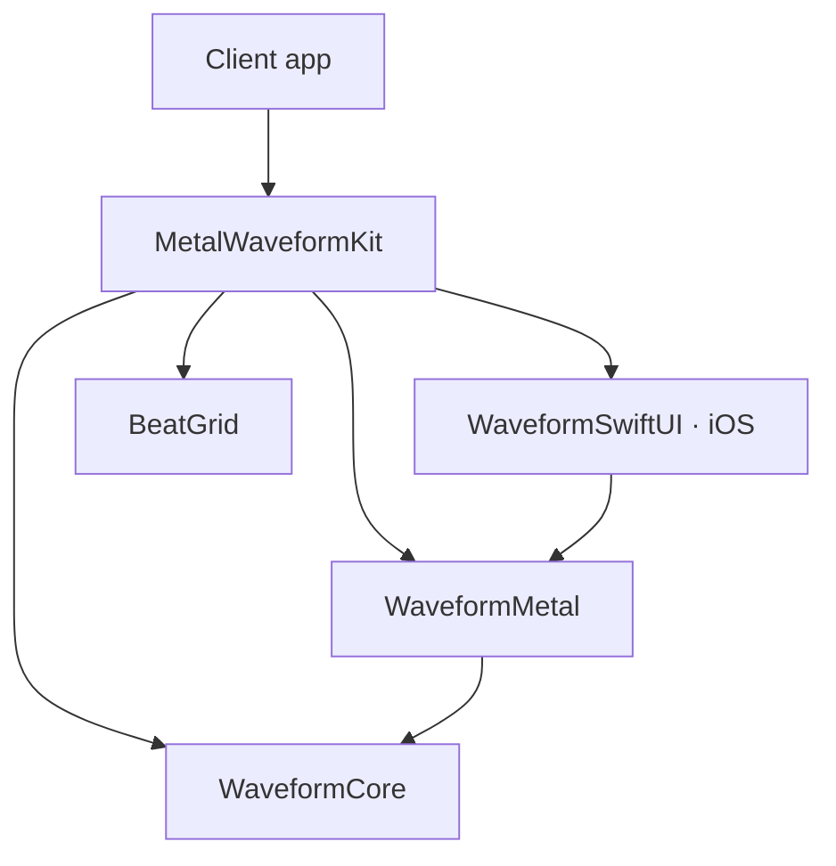

# パッケージの構成と依存関係

[English](ARCHITECTURE.md) | 日本語 · [READMEへ戻る](../README.ja.md)

MetalWaveformKitは、解析・描画・UI連携をSwiftPMのターゲットで分けています。最初は製品`MetalWaveformKit`を追加すると、一つのimportで使い始められます。必要な機能だけを組み込む場合は、個別の製品を選べます。

## ファイルの配置

```text
MetalWaveformKit/
├── Package.swift
├── Sources/
│   ├── MetalWaveformKit/                # まとめてimportするための窓口
│   ├── WaveformCore/                    # PCM解析と時間座標の計算
│   ├── WaveformMetal/                   # レンダラーとShaders.metal
│   ├── WaveformSwiftUI/                 # iOS用SwiftUIビュー
│   └── BeatGrid/                        # 秒単位の拍計算
├── Tests/
│   ├── WaveformCoreTests/
│   ├── BeatGridTests/
│   ├── WaveformMetalTests/              # GPUデバイスを使わない計算テスト
│   └── WaveformMetalGPUTests/           # 実際にMetalで描画する画像テスト
├── Examples/
│   └── RenderingDemo/                   # ローカルパッケージを使うiOSアプリ
│       ├── RenderingDemo/               # 操作付きデモと最小コード
│       └── RenderingDemo.xcodeproj/
├── docs/                                # 導入、設計、検証、メディア
├── .github/
│   └── workflows/
│       └── ci.yml
├── README.md
├── README.ja.md
├── CONTRIBUTING.md
├── CHANGELOG.md
└── LICENSE
```

`Sources/<ターゲット名>`と`Tests/<ターゲット名>`はSwiftPMの標準配置です。サンプルはライブラリの製品に含めず、Xcodeプロジェクトから相対パスでパッケージを参照します。

シェーダーは`WaveformMetal`のリソースとして配布し、`Bundle.module`から読み込みます。

## 依存はUIから描画、描画から解析へ向かう

矢印は「依存する側 → 依存先」を示します。



| 製品 | 直接依存する製品 | 選ぶ場面 |
| --- | --- | --- |
| `MetalWaveformKit` | 下記4製品 | 一つのimportで使い始める |
| `WaveformSwiftUI` | `WaveformMetal` | iOSのSwiftUIに波形を表示する |
| `WaveformMetal` | `WaveformCore` | `MTKView`へ直接組み込む |
| `WaveformCore` | なし | 解析・座標計算だけを使う |
| `BeatGrid` | なし | 拍への丸め・境界計算だけを使う |

CoreとBeatGridはMetal、SwiftUI、音声エンジンに依存しません。

個別製品を使う場合は、コードで直接importする各モジュールをターゲットの依存にも追加します。たとえばiOSのビュー、解析、レンダラーを使うコードなら、`WaveformSwiftUI`・`WaveformMetal`・`WaveformCore`を選びます。

macOSではCore・Metal・BeatGridを利用できます。`WaveformSwiftUI`はiOS用の`UIViewRepresentable`のみを含み、macOS用のSwiftUIビューは提供していません。

## アプリが再生状態を持ち、ライブラリへ描画入力を渡す

| 担当 | 責務 |
| --- | --- |
| アプリ | PCMの用意、音声再生、クロック、キューの実行、ジェスチャ。音声クロックへの対応付け、出力遅延の扱い、中断中の再生状態も管理する。 |
| `WaveformMetal` | 解析結果と秒単位の再生位置を受け取り、画面へ投影する。入力を1フレームに一度取得し、波形・グリッド・キューのスナップ済み座標を共有しつつ、同期モードの再生線を中央に固定する。 |
| `WaveformSwiftUI` | 表示タイミングとビューのライフサイクルを管理する。 |

この分担により、利用側は再生エンジンや画面の設計を選べます。

### フレーム入力

`timedFrameInputProvider`を使う場合は、`CACurrentMediaTime()`と同じ基準の表示予定時刻を、利用側でトラック内の秒へ変換します。設定するとこちらを優先し、未設定なら従来の引数なし`frameInputProvider`を使います。

MVVMを採用するアプリなら、ViewModelからレンダラーを保持し、フレーム入力を供給できます。ライブラリ本体にViewModel・Repository・UseCaseの層を追加する必要はありません。サンプルアプリでは、画面モデルにこの連携処理を置いています。

### 表示タイミングとライフサイクル

`WaveformSwiftUI`は、表示先のスクリーンに対応する`CADisplayLink`から`MTKView.draw()`を呼び、`targetTimestamp`を`WaveformMetal`へ渡します。

- ウィンドウから外れたときや非アクティブ時は、表示更新を停止します。
- 破棄時はdisplay linkを解除します。
- SwiftUIの更新によるレンダラー交換も受け付けます。

座標の許容差とfpsの制約は[描画の設計](DESIGN.ja.md)を参照してください。

## サンプルのUIはライブラリから分ける

サンプルのボタン装飾は`HardwareButtonStyle.swift`、画面の計測と配置は`RenderingDemoLayout.swift`に分けています。どちらもサンプル内のUI実装で、ライブラリの公開APIには含めません。

### ピクセル比較

`PixelSnapComparisonView.swift`は、必要に応じて開くピクセル比較画面を担当します。同じ解析結果と時刻を2つのレンダラーへ渡し、カメラスナップだけを変えて96×48ピクセルで描画します。両方の出力から同じ領域を切り出し、24倍に拡大して表示します。

比較用の時刻はメイン画面と分けて管理します。キャンセル可能なタスクが、カメラへの入力を800 msごとに0と0.25ピクセルの間で切り替えます。手動操作、画面を閉じる操作、バックグラウンドへの移行で停止します。

### 説明文の言語

`ExplanationLanguage.swift`は説明文の言語選択と共通メニューを担当し、`Explanations.xcstrings`に6段落の英語・日本語を保存します。両ファイルはサンプルアプリ専用です。

メイン画面が選択を保持し、比較画面へBindingで渡します。切り替え時に描画モデルを作り直したり、画面全体のlocaleを変えたりしません。

## テストと互換性の境界

計算テストとGPU画像テストを別ターゲットに分けています。

- 通常のCIは、計算テストとiOSサンプルのビルドを実行します。
- Metal対応Macでは、`swift test`でGPU画像テストも含めて確認します。

実行手順は[貢献ガイド（英語）](../CONTRIBUTING.md#test-a-change)、確認済みの環境は[動作確認](VALIDATION.ja.md)を参照してください。

マニフェストはSwift tools 6.1を要求します。型への`nonisolated`指定は[SE-0449](https://github.com/swiftlang/swift-evolution/blob/main/proposals/0449-nonisolated-for-global-actor-cutoff.md)でSwift 6.1に導入されたためです。これは構文上の下限であり、Swift 6.1での実ビルドを確認したという意味ではありません。

配置と製品・ターゲットの定義は[SwiftPMの公式仕様](https://docs.swift.org/package-manager/PackageDescription/PackageDescription.html)に基づきます。描画の更新タイミングや精度は[描画の設計](DESIGN.ja.md)で説明します。
