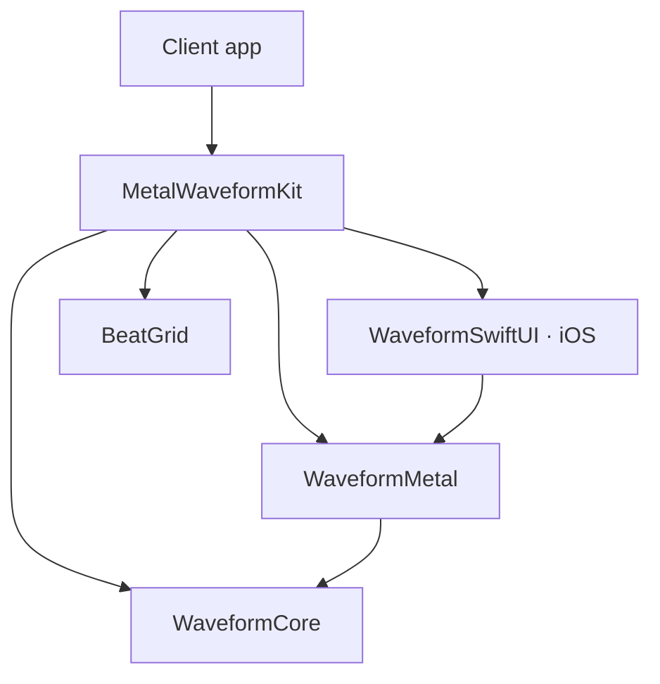

# Package structure and dependencies

English | [日本語](ARCHITECTURE.ja.md) · [Back to README](../README.md)

Analysis, rendering and UI integration are separate SwiftPM targets. Start with the `MetalWaveformKit` product; choose individual products when you need a smaller API surface.

## Repository layout

```text
MetalWaveformKit/
├── Package.swift
├── Sources/
│   ├── MetalWaveformKit/                # Umbrella imports
│   ├── WaveformCore/                    # PCM analysis and time projection
│   ├── WaveformMetal/                   # Renderer and Shaders.metal
│   ├── WaveformSwiftUI/                 # iOS SwiftUI view
│   └── BeatGrid/                        # Beat calculations in seconds
├── Tests/
│   ├── WaveformCoreTests/
│   ├── BeatGridTests/
│   ├── WaveformMetalTests/              # Calculations without a GPU device
│   └── WaveformMetalGPUTests/           # Metal image tests
├── Examples/
│   └── RenderingDemo/                   # iOS app using the local package
│       ├── RenderingDemo/               # Interactive example and minimal view
│       └── RenderingDemo.xcodeproj/
├── docs/                                # Integration, design, validation and media
├── .github/
│   └── workflows/
│       └── ci.yml
├── README.md
├── README.ja.md
├── CONTRIBUTING.md
├── CHANGELOG.md
└── LICENSE
```

`Sources/<target>` and `Tests/<target>` follow the SwiftPM layout. The example is not a library product; its Xcode project references the package by relative path.

Shaders are resources of `WaveformMetal` and load through `Bundle.module`.

## Dependencies flow from UI to rendering to analysis

Arrows point from a client to its dependency.



| Product | Direct dependencies | Use it for |
| --- | --- | --- |
| `MetalWaveformKit` | All four products below | A single import to get started |
| `WaveformSwiftUI` | `WaveformMetal` | An iOS SwiftUI waveform view |
| `WaveformMetal` | `WaveformCore` | Direct integration with `MTKView` |
| `WaveformCore` | None | Analysis and coordinate calculations |
| `BeatGrid` | None | Beat rounding and boundaries |

Core and BeatGrid do not depend on Metal, SwiftUI or an audio engine.

When choosing individual products, declare every module that your code imports directly. For an iOS view with analysis and a renderer, select `WaveformSwiftUI`, `WaveformMetal` and `WaveformCore`.

On macOS, use Core, Metal and BeatGrid. `WaveformSwiftUI` contains an iOS `UIViewRepresentable`; it does not provide a macOS SwiftUI view.

## Apps own playback and supply frame input

| Component | Responsibility |
| --- | --- |
| App | Supply PCM audio samples, playback, a clock, cue execution and gestures. Own audio-clock mapping, output-latency policy and playback during interruptions. |
| `WaveformMetal` | Receive analysis results and track positions in seconds, then project them onto the display. Resolve one input per frame and share the snapped projection across waveform, grid and cues, while keeping the synced playhead centered. |
| `WaveformSwiftUI` | Manage display scheduling and the view lifecycle. |

This boundary lets clients choose their audio engine and presentation architecture.

### Frame input

For `timedFrameInputProvider`, the app maps a target host timestamp in the `CACurrentMediaTime()` time domain to track seconds. The optional timed provider takes priority over the supported no-argument `frameInputProvider`.

An MVVM app can retain the renderer and supply frame input from a view model. The library itself does not require ViewModel, Repository or UseCase layers. The sample app keeps this integration code in its screen model.

### Display scheduling and lifecycle

`WaveformSwiftUI` uses a screen-specific `CADisplayLink` to drive manual `MTKView.draw()` calls, forwarding `targetTimestamp` to `WaveformMetal`.

- Display updates stop while the view is detached or inactive.
- The display link is cleaned up on teardown.
- SwiftUI updates can replace the renderer.

See [rendering design](DESIGN.md) for projection tolerance and frame-rate limits.

## Sample UI stays outside the library

The example keeps button appearance in `HardwareButtonStyle.swift` and view measurement and placement in `RenderingDemoLayout.swift`. Both belong to the sample UI and are separate from the library’s public API.

### Pixel inspection

`PixelSnapComparisonView.swift` owns the optional pixel-inspection screen. It gives two instances of the package renderer the same analysis and time, changes only camera snapping, and displays the same cropped detail of their 96×48-pixel output at 24× magnification.

Its inspection clock is independent of the main demo. A cancellable task alternates the input between 0 and 0.25 pixels every 800 ms. Manual controls, dismissal and backgrounding pause the cycle.

### Explanation language

`ExplanationLanguage.swift` selects the explanation language and provides the shared menu. `Explanations.xcstrings` contains six English/Japanese paragraphs. These resources belong only to the example.

The main view owns the saved preference and passes a binding into the inspection sheet. Changing the language does not recreate the render models or change the locale of the whole view.

## Testing and compatibility boundaries

Calculation tests and GPU image tests use separate targets:

- Normal CI runs calculation tests and builds the iOS example.
- On a Metal-capable Mac, `swift test` also runs the image tests.

See the [contributing guide](../CONTRIBUTING.md#test-a-change) for test commands and [validation](VALIDATION.md) for tested environments.

The manifest requires Swift tools 6.1 because type-level `nonisolated` was introduced in Swift 6.1 by [SE-0449](https://github.com/swiftlang/swift-evolution/blob/main/proposals/0449-nonisolated-for-global-actor-cutoff.md). This is a syntax requirement, not a claim that this package has been built with Swift 6.1.

The layout, products and targets follow the [SwiftPM package specification](https://docs.swift.org/package-manager/PackageDescription/PackageDescription.html). See [rendering design](DESIGN.md) for update timing and precision.
