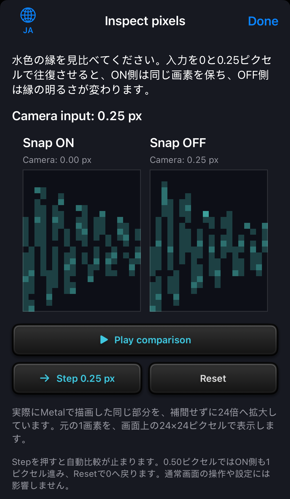
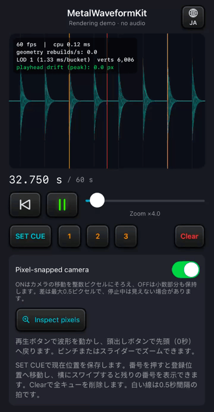
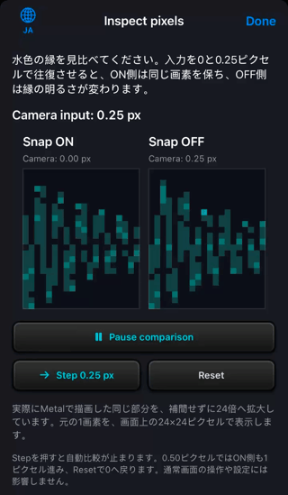

# RenderingDemoの操作と描画例

[English](EXAMPLES.md) | 日本語 · [READMEへ戻る](../README.ja.md)

このページの画像と動画は、パッケージに付属する[RenderingDemo](../Examples/RenderingDemo/RenderingDemo/RenderingDemoApp.swift)を収録したものです。合成データと表示用クロックで波形を動かし、音声は再生しません。

## サンプルを起動する

1. `Examples/RenderingDemo/RenderingDemo.xcodeproj`をXcodeで開きます。
2. Schemeで**RenderingDemo**、実行先でiPhoneシミュレーターを選びます。
3. **Run**をクリックします。

起動直後は32秒の位置・4倍ズームで停止し、30・32・34秒のキューを表示します。60秒の末尾でアニメーションを停止し、再生アイコンを押すと32秒から再開します。

実機で動かすときは、次の手順に従ってXcodeで自身の署名チームを指定してください。Canvasでの確認手順は[導入ガイド](GETTING_STARTED.ja.md#xcodeのcanvasでプレビューする)に記載しています。

## 実機で滑らかさを確認する

iPhone 14を含む、iOS 17以降のiPhone／iPadで実行できます。

1. iPhoneまたはiPadをUSBケーブルでMacに接続し、端末のロックを解除します。
2. 端末の画面に「このコンピュータを信頼しますか？」と表示されたら、**「信頼」**をタップします。パスコードの入力を求められた場合は、端末のパスコードを入力します。
3. Xcodeの`RenderingDemo`ターゲットで **Signing & Capabilities** を開き、自分の **Team** を選んで **Automatically manage signing** を有効にします。Apple Accountの登録はXcodeの設定から行います。
4. 端末で求められた場合は、**設定 → プライバシーとセキュリティ → デベロッパモード** を有効にします。端末を再起動し、確認を求められたら有効にします。
5. Xcode上部のSchemeで **RenderingDemo Performance**、実行先で接続した端末を選びます。
6. **Run**をクリックします。

`RenderingDemo Performance`は、最適化したRelease構成でデバッガを付けずに起動します。通常の`RenderingDemo`は、開発とCanvas用のDebug構成です。Performanceではブレークポイントで停止できないため、デバッグするときは通常のSchemeへ戻してください。

まず1倍・4倍で再生し、拍線や波形の大きな山が一定の間隔で動くかを確認します。

HUDのfpsは描画命令の送信回数であり、実際の表示間隔を測った値ではありません。シミュレーターの結果だけでは実機の滑らかさを判断できません。

接続時の信頼設定は[Appleサポートの案内](https://support.apple.com/ja-jp/109054)を参照してください。署名と実行は[Appleの実機実行手順](https://developer.apple.com/documentation/xcode/running-your-app-on-simulated-or-physical-devices)、設定は[デベロッパモードの手順](https://developer.apple.com/documentation/xcode/enabling-developer-mode-on-a-device)を参照してください。

## 説明文を日本語に切り替える

1. 地球アイコン（EN／JA）を押します。メイン画面では右上、Inspect pixelsでは左上にあります。
2. 日本語を選びます。

説明文だけが切り替わり、タイトル・見出し・ボタン名・数値表示は英語のままです。

言語は両画面で共有し、次回起動時にも保持します。初回は端末の最優先言語が日本語なら日本語、それ以外は英語です。切り替えても、再生位置・ズーム・キュー・比較の状態は変わりません。

  

## Animateで波形を動かす

再生ボタンで表示用クロックを操作します。

- **Animate**（再生アイコン）：クロックを進め、波形を動かします。
- **Pause**（一時停止アイコン）：アニメーションを止めます。
- **Return to beginning**（再生／一時停止ボタンの左隣）：先頭の0秒へ戻します。

先頭へ戻した後も、再生中なら波形が動き続け、停止中なら0秒で停止します。ズームとキューも保持します。

現在の実装は、display linkの表示予定時刻から表示用クロックを計算します。同期モードの再生線は画面中央に固定し、波形・拍グリッド・キューを共通のスナップ済みカメラで動かします。ウィンドウから外れたときや非アクティブ時には描画を止め、復帰時は新しい表示予定時刻で再開します。

  

[動画を開く（MP4・8秒・音声なし）](media/rendering-demo-start-animation-ja.mp4)。GIFは4秒の短縮プレビューです。

ボタンには角丸の枠と縁のハイライトがあり、押すと陰影が変わります。アニメーション中は一時停止アイコンが黄緑に光ります。

## HUDで描画統計を確認する

起動時から、波形の左上に描画統計を示す4行のHUDを表示します。ラベルは英語で、統計は0.5秒ごとに更新します。

- **fps / cpu**：描画コールバックの頻度と、描画処理のCPU側の平均経過時間。GPU完了までの時間は含みません。
- **geometry rebuilds/s**：波形の頂点バッファを構築した回数を、1秒あたりに換算した値。同じLODのキャッシュを再利用している間は0になります。
- **LOD / ms/bucket / verts**：選択中の詳細度、1区間の時間幅、描画対象の波形頂点数。ズームや表示位置によって変化します。
- **playhead drift (peak)**：直近0.5秒間で、2つの再生時刻をCPU上で画面座標へ変換したときの位置の差の最大値。通常の同期モードでは0です。GPUの画素誤差、ピクセルスナップの効果、音声との同期精度を測る値ではありません。`0.0`は小数1桁に丸めた表示です。

値は実行環境や描画条件によって変わります。計測の範囲は[描画の設計](DESIGN.ja.md#比較用の設定と計測値)を参照してください。

## 同じ位置を1倍・4倍・64倍で比べる

同じ32秒の位置で停止し、左から1倍・4倍・64倍に拡大しています。表示範囲はそれぞれ16秒・4秒・0.25秒です。ピンチまたはスライダーで倍率を変えられます。

再生中に倍率を上げると、合成データの110 Hzの波が見分けやすくなります。周期的な動きをフレームごとに表示するため、等間隔に描画していても明滅や不均一な動きに見える場合があります。表示予定時刻の利用と再生線の中央固定では、この現象（時間方向のエイリアシング）は解消しません。見た目だけではフレームの欠落と判定できません。

## SET CUEで保存し、番号でその位置へ移動する

**SET CUE**で現在位置を保存すると、番号付きのキューが時刻順に並びます。起動時の32秒にはすでにキューがあるため、そのままSET CUEを押しても数は増えません。

新しい位置を保存し、その位置へ戻る手順は次のとおりです。

1. **Animate**で波形を動かし、起動時の位置から進めます。
2. **SET CUE**を押し、現在位置を保存します。
3. 追加された番号を押し、その位置へ戻ります。動作中ならアニメーションを続けます。

48 kHzの同じサンプル位置は重複登録せず、上限は8個です。番号が収まらないときは、キューの列を横にスワイプできます。**Clear**で全キューを削除します。

## iPhoneの横向きでは波形と設定を左右に並べる

左列に波形・時刻・操作ボタン・ズーム・マーカー操作、右列に設定と説明を配置します。回転してもアニメーション、倍率、マーカー、ピクセルスナップの状態は保たれます。

iPadは縦横とも一列で表示します。大きな文字サイズや幅が足りない場合は、スクロールで操作できます。

## ピクセルスナップを比べる

**Pixel-snapped camera**をONにすると、波形の横移動を画面の実ピクセル単位にそろえます。OFFでは小数ピクセル単位の移動を許します。移動中の細かな明滅を抑えるための設定で、音声再生や波形の振幅は変えません。

1. **Animate**で波形を動かします。
2. **Pixel-snapped camera**のON/OFFを切り替え、波形の細部を見比べます。比較中は倍率を変えずに保ちます。

丸めによる位置の変化は最大0.5描画ピクセルです。同期モードの再生線は画面中央に固定します。

再生線が示す時刻を波形・グリッド・キュー側の座標変換で描いた位置は、再生線の中心から最大0.5描画ピクセルずれます。これに浮動小数点演算とラスタライズの許容差が加わります。停止中や、もともと整数ピクセルにそろっている位置では、見た目の差が小さい、または差が出ないことがあります。

### Inspect pixelsで、同じ縁の明滅を見る

**Inspect pixels**を開くと、カメラへの入力が0と0.25ピクセルの間を自動で往復します。左右には、同じ波形の一部を24倍に拡大して表示します。

**右側の水色の縁**を見てください。左のSnap ONは同じ画素を保ち、右のSnap OFFは縁の明るさが変わります。画面の幅が足りない場合や大きな文字サイズでは、ON・OFFを上下に並べます。

  

[比較動画を開く（MP4・8秒・音声なし）](media/rendering-demo-language-pixels-ja.mp4)。GIFは6.4秒のループです。[静止画](media/rendering-demo-language-pixels-ja.png)でも配置を確認できますが、明滅の比較には動画を使ってください。

比較の動きは、次のボタンで操作できます。

- **Pause comparison**で動きを止め、**Play comparison**で再開します。
- **Step 0.25 px**を押すと自動比較が止まり、入力を0.25ピクセルずつ進めます。0.50ピクセルではON側も整数1ピクセル進みます。
- **Reset**は比較を止めて0へ戻します。

端末で「視差効果を減らす」が有効な場合は、停止状態で開きます。

96×48ピクセルのMetal描画から、再生線を含まない同じ範囲を切り出し、補間せずに各画素を拡大しています。比較中の入力は両側で共通です。通常画面の時刻・倍率・設定は変更しません。

## 画像・動画の収録条件

画像と動画は、iPhone 16 / iOS 18.6シミュレーターで収録しました。時刻・通信状態・バッテリー・ホームインジケーターを含むセーフエリアを除き、動画と比較画像は縮小しています。

メイン画面の画像・動画は、頭出しアイコン・SET CUE・4行のHUDを備えた同梱サンプルで統一しています。説明文を含む画像・動画は、日本語ページでは日本語、英語ページでは英語で収録しています。タイトル・見出し・ボタン名はアプリの仕様どおり英語です。

画像・動画は操作や描画の見え方を示すものです。画面内のfpsとCPU時間は収録時の値であり、性能の保証値ではありません。

現在のビューは画面の最大fpsを要求しますが、ProMotionを含む実際の更新頻度はOSや描画条件に左右されます。

音声と連動させる場合は、利用側で再生エンジンと音声クロックを用意します。`timedFrameInputProvider`で表示予定のホスト時刻をトラック内の秒へ変換してください。[導入ガイドのコード例](GETTING_STARTED.ja.md#音声の再生位置と連動させる)を参照できます。音声再生を含む登壇用MetalWaveformDemoは同梱していません。
