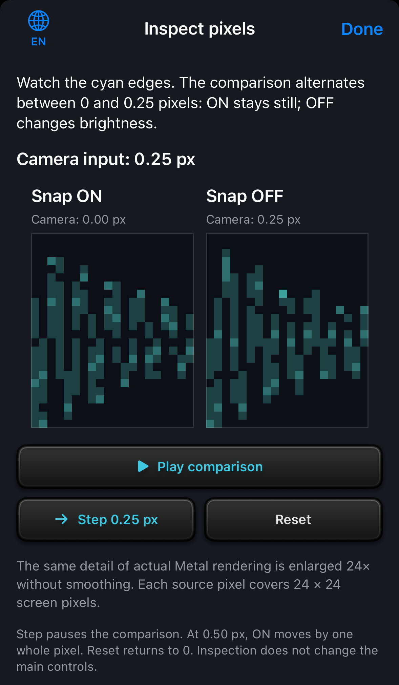
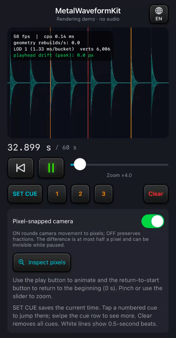
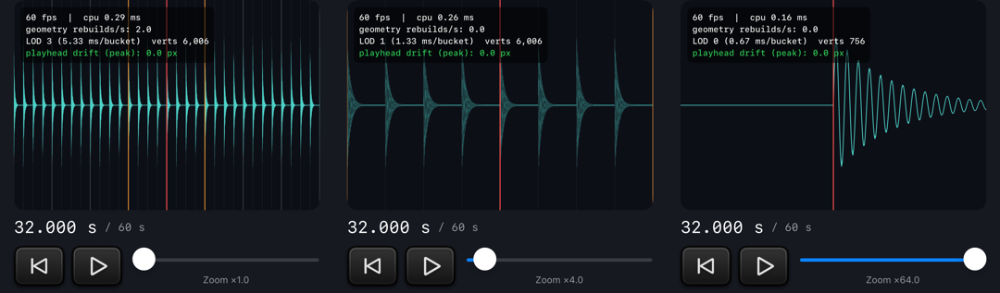
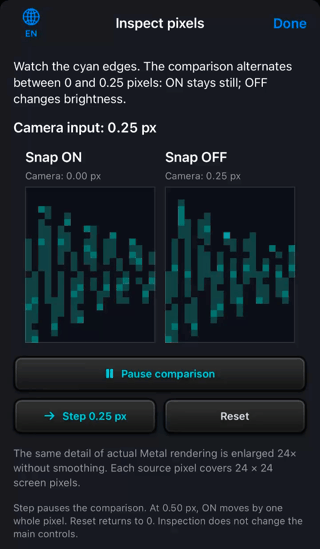

# RenderingDemo controls and rendering examples

English | [日本語](EXAMPLES.ja.md) · [Back to README](../README.md)

All images and videos on this page show [RenderingDemo](../Examples/RenderingDemo/RenderingDemo/RenderingDemoApp.swift), the app included in this package. It animates generated waveform data using a visual clock and does not play audio.

## Run the sample app

1. Open `Examples/RenderingDemo/RenderingDemo.xcodeproj` in Xcode.
2. Select the **RenderingDemo** scheme and an iPhone simulator as the run destination.
3. Click **Run**.

The app starts paused at 32 seconds with 4× zoom and cues at 30, 32 and 34 seconds. Animation stops at the 60-second end; pressing the play icon then restarts at 32 seconds.

For a physical device, select your own signing team in Xcode as described below. See the [getting started guide](GETTING_STARTED.md#preview-in-xcode-canvas) for Canvas instructions.

## Check motion on a physical device

The sample runs on iPhone and iPad with iOS 17 or later, including iPhone 14.

1. Connect your iPhone or iPad to your Mac with a USB cable, then unlock the iPhone or iPad.
2. If “Trust This Computer?” appears on the iPhone or iPad, tap **Trust**. Enter the device’s passcode if prompted.
3. In Xcode, open **Signing & Capabilities** for the `RenderingDemo` target. Choose your own **Team** and enable **Automatically manage signing**. Add your Apple Account in Xcode settings if needed.
4. If prompted, enable **Settings → Privacy & Security → Developer Mode** on the device. Restart the device and confirm.
5. In Xcode, select the **RenderingDemo Performance** scheme and your connected device as the run destination.
6. Click **Run**.

`RenderingDemo Performance` launches an optimized Release build without attaching the debugger. The regular `RenderingDemo` scheme uses Debug for development and Canvas. Switch back to that scheme when you need breakpoints.

Start at 1× and 4× and check whether beat lines and the large waveform peaks move at regular intervals.

The HUD's fps value counts draw submissions; it does not measure presentation intervals. Simulator behavior alone does not establish smoothness on a physical device.

For connection prompts, see Apple's [computer trust instructions](https://support.apple.com/en-us/109054). See the [device and signing instructions](https://developer.apple.com/documentation/xcode/running-your-app-on-simulated-or-physical-devices) and [Developer Mode instructions](https://developer.apple.com/documentation/xcode/enabling-developer-mode-on-a-device) for setup details.

## Switch explanations between English and Japanese

1. Open the globe menu (EN/JA). It appears at the top right of the main screen and the top left of Inspect pixels.
2. Select English or 日本語.

Only explanatory paragraphs change; titles, headings, control labels and numeric readouts stay in English.

Both screens share the choice and retain it across launches. The initial choice is Japanese when the device’s first preferred language is Japanese, otherwise English. Switching preserves the clock, zoom, cues and comparison state.

  

## Animate the waveform

Use the playback buttons to control the visual clock:

- **Animate** (play icon): Advance the clock and scroll the waveform.
- **Pause** (pause icon): Stop the animation.
- **Return to beginning** (button to the left of play/pause): Return to 0 seconds.

Returning preserves the current playing or paused state, zoom and cues.

The current implementation evaluates its visual clock at the display link's target timestamp. The synced playhead stays at screen center while the waveform, beat grid and cues move together using the snapped camera. The view stops drawing while detached or inactive and resumes with fresh display timestamps.

  

[Open video (MP4, 8 seconds, no audio)](media/rendering-demo-start-animation.mp4). The GIF is a four-second preview.

The buttons have rounded housings, edge highlights and shadows that change when pressed. The pause icon glows yellow-green while the animation runs.

## Read the rendering HUD

The four-line HUD shows rendering statistics at the top left of the waveform from startup. Labels stay in English, and statistics update every 0.5 seconds.

- **fps / cpu**: Draw-callback frequency and average CPU-side elapsed time for rendering. CPU time excludes GPU completion.
- **geometry rebuilds/s**: Waveform vertex-buffer builds expressed as a rate per second. It stays at zero while the same LOD's cached buffer is reused.
- **LOD / ms/bucket / verts**: The selected level of detail, time covered by each bucket, and submitted waveform vertex count. These can change with zoom or viewport position.
- **playhead drift (peak)**: The largest difference between the screen positions calculated on the CPU for two playhead times in the latest 0.5-second window. It is zero in the normal synchronized mode; it does not measure GPU pixel error, pixel-snapping effectiveness or audio synchronization. `0.0` is rounded to one decimal place.

Values depend on the environment and rendering conditions. See [rendering design](DESIGN.md#measurement) for measurement boundaries.

## Compare 1×, 4× and 64× zoom at the same position

All three views are paused at 32 seconds. From left to right, 1×, 4× and 64× zoom show 16, 4 and 0.25 seconds. Pinch or use the slider to change zoom.

During animation, high zoom reveals the generated signal's 110 Hz detail. Even regularly spaced frames can make that periodic detail appear to flicker or move unevenly through temporal aliasing. Display-aligned timing and a centered playhead do not remove this effect, and appearance alone is not evidence of dropped frames.

## Save with SET CUE and jump with numbered cues

**SET CUE** saves the current time and shows numbered cues in time order. There is already a cue at the initial 32-second position, so pressing SET CUE while paused there does not add another.

To save and return to a new position:

1. Press **Animate** to move away from the initial position.
2. Press **SET CUE** to save the current position.
3. Tap its numbered cue to return to that position. Animation continues if it was running.

The sample avoids duplicate positions at its 48 kHz sample rate and stores up to eight cues. Swipe the cue row horizontally to reach more buttons; **Clear** removes all cues.

## Rotate an iPhone to place settings beside the waveform

Waveform, time, transport, zoom and marker controls occupy the left column; settings and explanations occupy the right. Rotation preserves animation, zoom, markers and pixel snapping.

iPad keeps one column in either orientation. Large accessibility text or insufficient width uses a scrolling column.

## Compare pixel snapping

With **Pixel-snapped camera** ON, horizontal camera movement is rounded to whole physical pixels. OFF preserves fractional-pixel movement. This setting can reduce fine flickering during scrolling; it does not change audio playback or waveform amplitude.

1. Press **Animate**.
2. Toggle **Pixel-snapped camera** while watching the waveform details. Keep the zoom level fixed during the comparison.

Rounding moves the camera by at most half a drawable pixel. The synced playhead remains centered.

For the track time represented by the playhead, the shared waveform/grid/cue projection can differ from the playhead's center by up to half a drawable pixel, plus floating-point and rasterization tolerance. A paused view or an already aligned camera position can show little or no visible difference.

### Watch the same edge change in Inspect pixels

Opening **Inspect pixels** automatically alternates the camera input between 0 and 0.25 pixels. The same waveform detail appears at 24× magnification on both sides.

Watch the cyan edges on the right: Snap ON on the left holds its pixels, while Snap OFF changes edge brightness. Narrow layouts and accessibility text sizes stack ON above OFF.

  

[Open comparison video (MP4, 8 seconds, no audio)](media/rendering-demo-language-pixels.mp4). The GIF loops 6.4 seconds. A [still image](media/rendering-demo-language-pixels.png) shows the layout; use the video to compare the changes over time.

To control the comparison:

- **Pause comparison** freezes the input; **Play comparison** restarts the cycle.
- **Step 0.25 px** stops automatic comparison and advances the input manually. At 0.50 px, ON also moves by one whole pixel.
- **Reset** pauses at zero.

When the device's Reduce Motion setting is enabled, the sheet opens paused.

Both views crop the same detail, excluding the playhead, from actual 96×48-pixel Metal output and enlarge it without smoothing. They share the same input. Inspection does not change the main demo's clock, zoom or settings.

## Image and video capture conditions

All images and videos were captured on an iPhone 16 / iOS 18.6 simulator. The safe areas containing the status bar and home indicator are cropped out; videos and comparison images are resized.

Main-screen images and videos use the included sample with the return-to-start icon, SET CUE and four-line HUD. Explanations in the captures match the page language: Japanese on the Japanese page and English on the English page. Titles, headings and button labels remain in English, as they do in the app.

The captures illustrate the controls and rendering behavior. Displayed fps and CPU times are values from the capture session, not performance guarantees.

The current view requests the screen's maximum frame rate, while actual delivery, including ProMotion, depends on the OS and rendering conditions.

To synchronize rendering with audio, provide a playback engine and audio clock in your app and map the target host timestamp to track seconds in `timedFrameInputProvider`. See the [integration example](GETTING_STARTED.md#follow-audio-playback). The separate MetalWaveformDemo used in the talk includes audio playback and is not bundled here.
